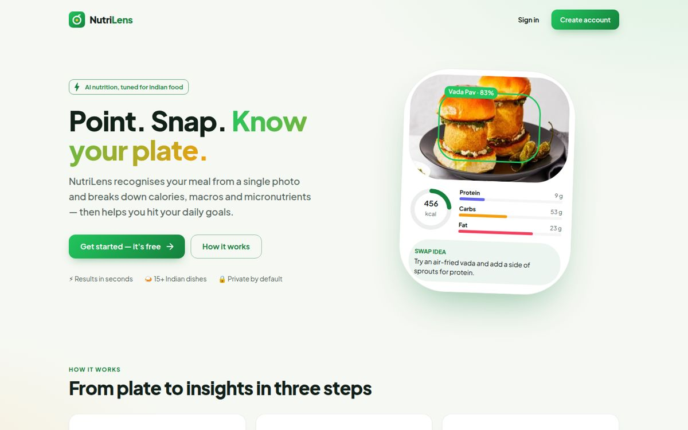
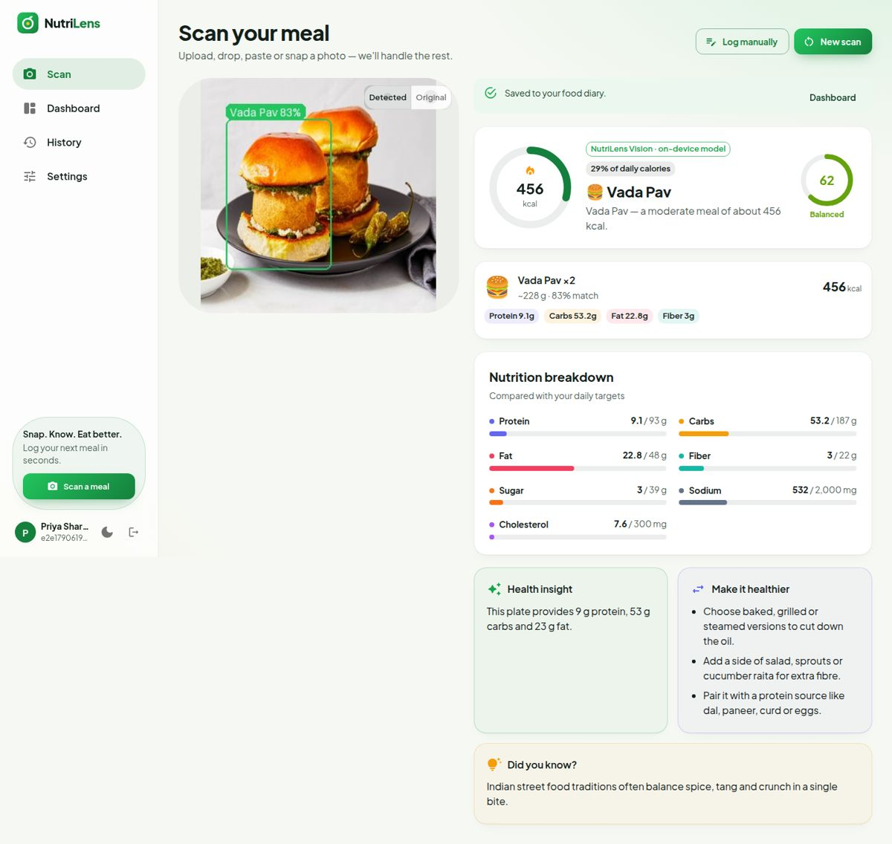
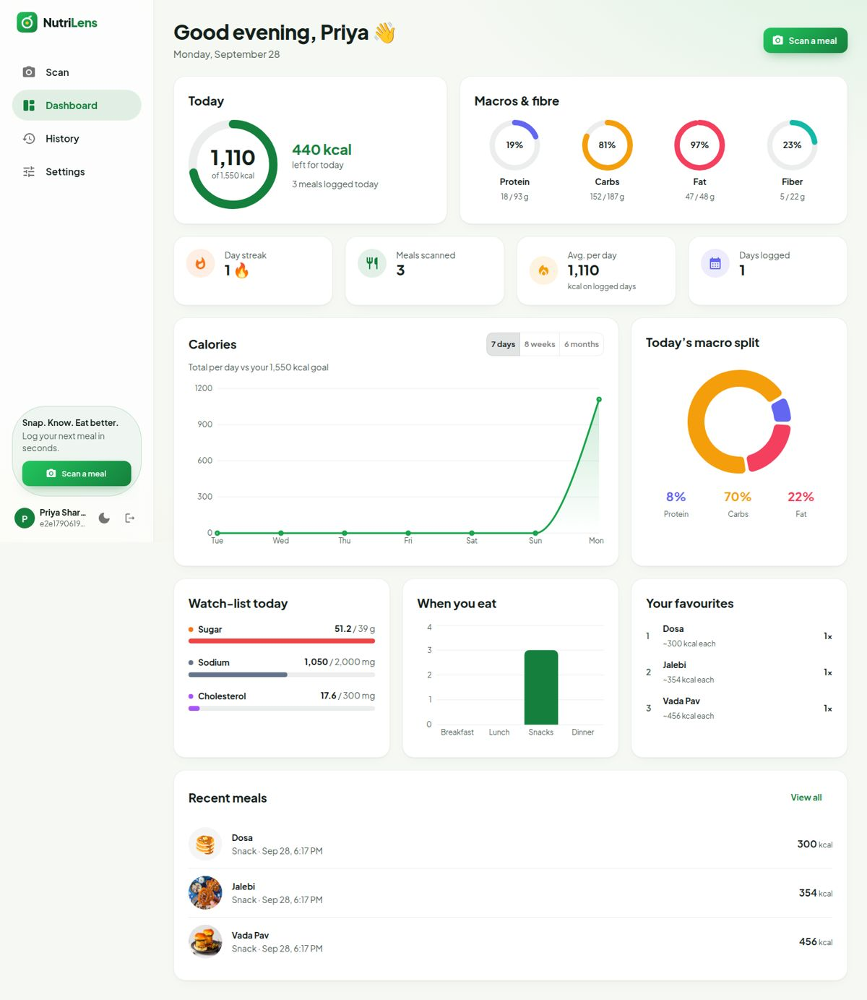
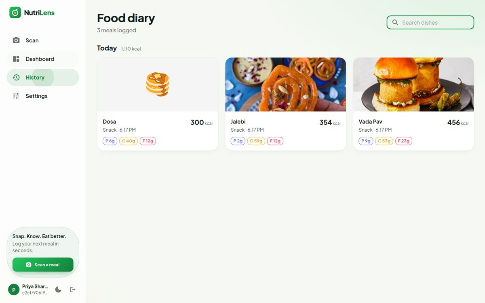
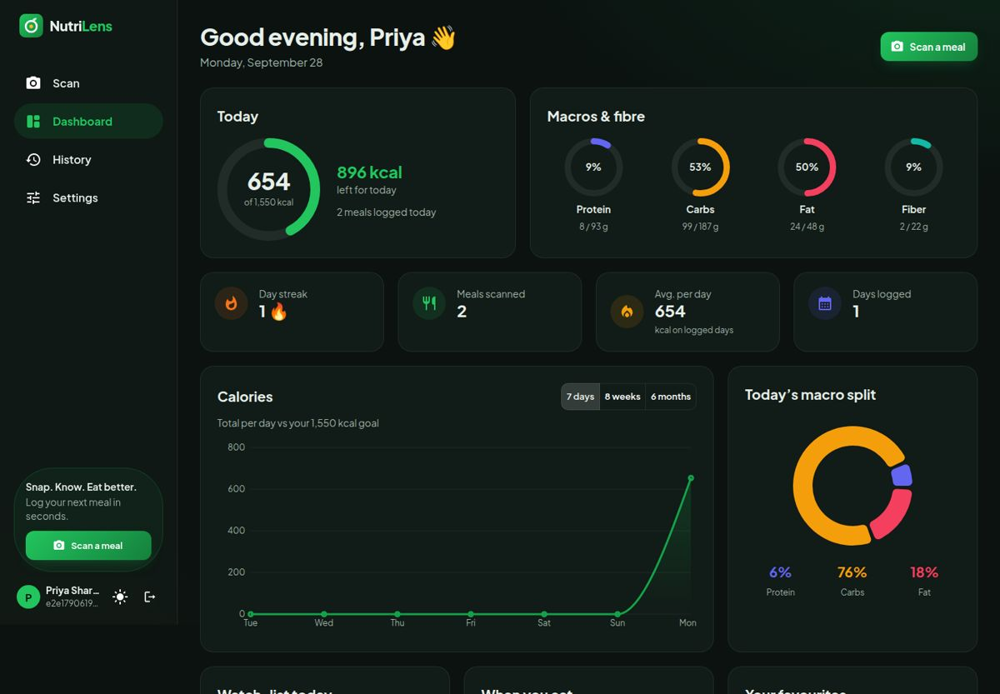
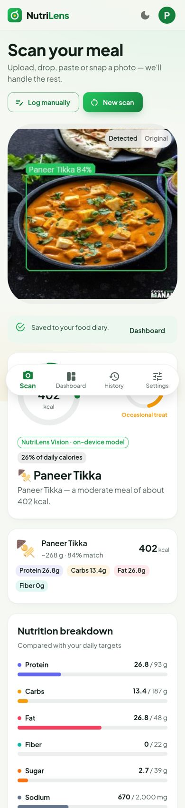

# 🥗 NutriLens — Web App

Snap a photo of your meal and get instant calories, macros, micronutrients and healthier swaps. NutriLens is tuned for Indian food.

**Live:** https://nutrilens-frontend.onrender.com · **API:** [NutriLens---Backend](https://github.com/Rajat22-11/NutriLens---Backend)



## Features

- **Scan a meal**: upload, drag-and-drop, paste (Ctrl/⌘ + V) or use the camera. Sample photos let you try it without one of your own.
- **Instant breakdown**: dishes detected on the photo, a calorie ring, a health score, eight nutrients compared with your daily goals, a health insight, healthier swaps and a fun fact.
- **Log manually**: add dishes from the built-in Indian food table when you don't have a photo.
- **Dashboard**: today's calorie and macro rings, day streak, calorie trends (7 days / 8 weeks / 6 months), macro split, sugar/sodium watch-list, meal timings and favourite foods. All are calculated in your local time zone.
- **Food diary**: every meal grouped by day, with search, a detail view and delete.
- **Settings**: profile and daily goals saved to your account, with suggested targets based on your body and activity level (Mifflin–St Jeor) for losing, maintaining or gaining weight.
- **Light, dark or system theme**, with a sidebar on desktop and a bottom navigation bar on mobile.

| Scan result | Dashboard |
|---|---|
|  |  |

| Food diary | Dark mode | Mobile |
|---|---|---|
|  |  |  |

## Tech stack

React 19 · Vite 7 · MUI 7 · Recharts 3 · React Router 7 · Axios · Plus Jakarta Sans

## Getting started

Requires Node.js 20 or newer and a running [NutriLens API](https://github.com/Rajat22-11/NutriLens---Backend).

```bash
npm install
cp .env.example .env        # set VITE_API_URL, e.g. http://localhost:5000
npm run dev                 # http://localhost:5173
```

| Script | What it does |
|---|---|
| `npm run dev` | Start the dev server |
| `npm run build` | Production build into `dist/` (also writes the SPA fallback pages) |
| `npm run preview` | Serve the production build locally |
| `npm run lint` | Run ESLint |

### Environment variables

| Variable | Description |
|---|---|
| `VITE_API_URL` | Base URL of the NutriLens API, without a trailing slash. Defaults to `http://localhost:5000` in development and the production API in builds. |

## Project structure

```
src/
├── api/client.js            # axios client: auth header, error messages, session expiry
├── components/
│   ├── AppLayout.jsx        # sidebar / bottom navigation shell
│   ├── MealResult.jsx       # meal breakdown used on Scan and History
│   └── ui.jsx               # Logo, ProgressRing, NutrientBar, StatCard, …
├── context/                 # AuthContext, ColorModeContext
├── pages/                   # Landing, Auth, Scan, Dashboard, History, Settings, NotFound
├── theme/theme.js           # light/dark theme and nutrient colours
└── utils/                   # nutrition helpers, goals hook, meal normaliser
scripts/spa-fallback.mjs     # copies index.html per route so deep links work on static hosts
```

## Deployment

The app is a static site on Render that redeploys automatically on every push to `main`. `render.yaml` describes the service. Set `VITE_API_URL` to the API URL on the service.
Direct links such as `/dashboard` work even without a rewrite rule, because the build writes an `index.html` for each route.

## License

For educational and personal use.
